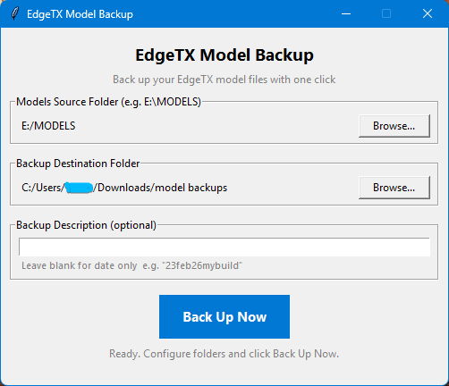

# EdgeTX Model backup App
EdgeTX windows app that backups your models. 
- Into a directory of your choice
- Renames models01 models02 into model names for easy locating when restoring single models
- Keeps a raw copy as well for when you wnat to restore all models or your radio config
- App will remember your directories so you dont have to constantly input it every time you run the app.

There is also a version for 2 different transmitters, eg two different paths for each transmitter.

[Download EdgeTX Model Backup.exe](https://github.com/Onewaytohell/EdgeTX-Model-backup/raw/refs/heads/main/EdgeTX%20Model%20Backup.exe) or 2 transmitter version[Download EdgeTX MultiBackup.exe](https://github.com/Onewaytohell/EdgeTX-Model-backup/raw/refs/heads/main/EdgeTX%20MultiBackup.exe)

